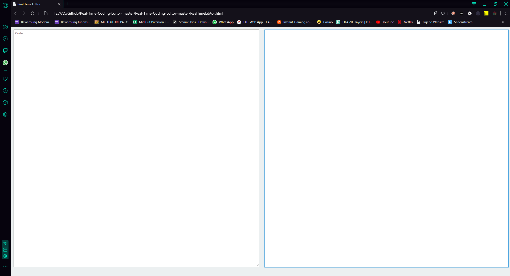
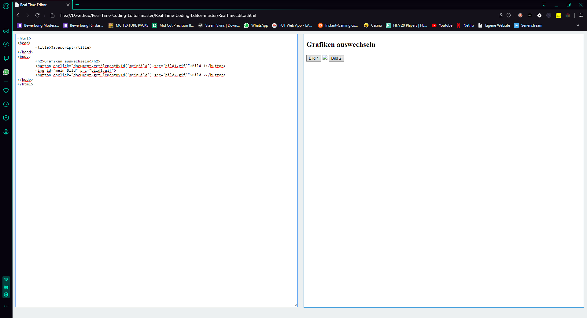
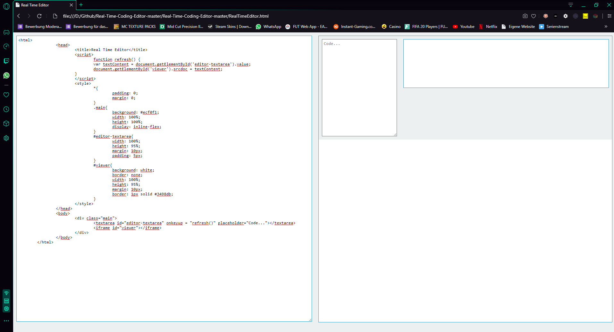

## Real-Time-Coding-Editor Deutsch

In diesem Editor(siehe Bild) könnt ihr Live Coden, da auf der rechten Seite der geschriebene Code (z.b. HTML5 oder Javascript) so ausgegeben wird, asl würde man ihn per .html datei öffnen.

In dem Bild seht Ihr, wie es aussieht, wenn ein Code oder Javascript fertig geschrieben wurde. So sieht es dann aus wenn man ein Button Click Event macht, welches durch einen Klick auf den Button das Bild wechseld(das man die Bilder dort sieht, kommt in der V1.1).

In diesem BIld seht Ihr, wie ein fertig geschriebener Code durch HTML5 aussieht. So sieht der RTE aus.

## Real-Time-Coding-Editor English

In this editor (see picture) you can live code, because on the right side the written code (e.g. HTML5 or Javascript) is output asl, you would open it via .html file.

In the picture you can see what it looks like when a code or Javascript has been written. This is how it looks when you make a button click event, which changes the picture by clicking on the button (the picture you see there comes in V1.1).

In this picture you can see what a completed code looks like with HTML5. This is what the RTE looks like.

Video: https://www.youtube.com/watch?v=r75st0g4aPk
